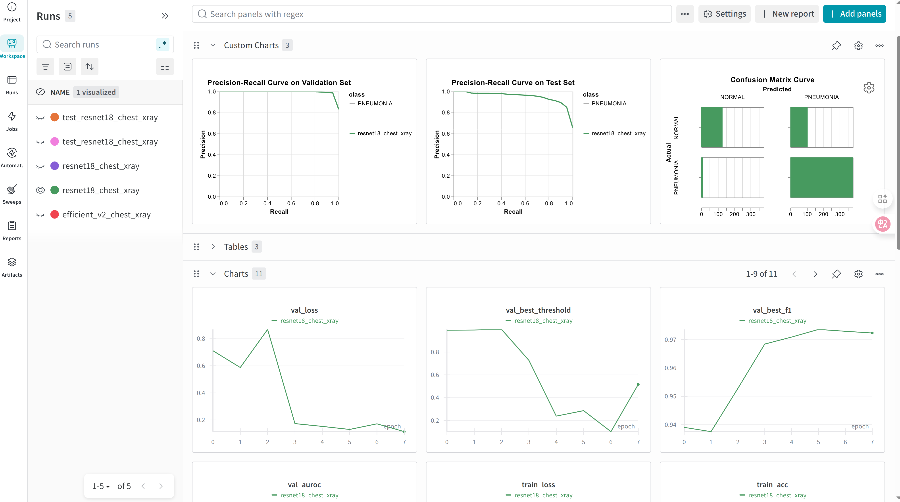

<div align="center">

# Medical Diagnosis with Transfer Learning

A modern Deep Learning project for medical diagnosis using PyTorch Lightning and Transfer Learning.

</div>

## Introduction

This project provides a framework for training and evaluating deep learning models for medical diagnosis tasks. It leverages PyTorch Lightning for streamlined training, Weights & Biases for experiment tracking, and Transfer Learning to utilize pre-trained models for improved performance. The current example focuses on diagnosing pneumonia from chest X-ray images.

## Hardware Requirements

- **NVIDIA GPU**: A CUDA-compatible NVIDIA GPU is required for training and evaluation.
- **CUDA**: CUDA 12.6 or a compatible version must be installed.

> [!note]
> run `nvidia-smi` to check your GPU and CUDA installation.

## Software Requirements

The project uses Python 3.12 and a set of libraries for deep learning, data manipulation, and command-line interface.

## Installation

1.  **Clone the repository:**
    ```bash
    git clone https://github.com/AtticusZeller/medical-diagnosis.git
    cd medical-diagnosis
    ```

2.  **Install dependencies:**
    It is recommended to use [uv](https://docs.astral.sh/uv/getting-started/installation/) to manage your virtual environments.
    ```bash
    uv sync --dev --all-extras
    uv pip install -e .
    ```
3.  **Download the dataset:**
    Make sure you have your Kaggle API token set up. Then run the following script:
    ```bash
    ./scripts/download_datasets.sh
    ```

## Usage

The project uses a command-line interface (CLI) for running experiments. The main entry point is `src/expt/main.py`.


### Training

To train a model, use the `--train` flag. The configuration for the training can be specified with the `--config` option.

> [!warning]
> update `logger.entity` of config file with your [wandb](https://wandb.ai/) team name
```bash
python src/expt/main.py --config config/resnet.yml --train
```

This will train the model and, upon completion, run the evaluation on the test set. The run ID of the training will be used for the evaluation.
> [!note]
> It will run evaluation automatically after training.

### Evaluation

To evaluate a specific model, you need to provide its run ID.

```bash
python src/expt/main.py --config config/resnet.yml --eval-id <your_run_id>
```

## Configuration

The experiments are configured using YAML files located in the `config` directory.

-   `config/train.yml`: Main configuration for training.
-   `config/resnet.yml`: Configuration for a ResNet model.
-   `config/efficientnet_v2.yml`: Configuration for an EfficientNetV2 model.
-   `config/sweep/`: Directory for sweep configurations.

You can create your own configuration files to experiment with different models, datasets, and hyperparameters.

## Tracking metrics in wandb


## License

This project is licensed under the MIT License - see the [LICENSE](LICENSE) file for details.
